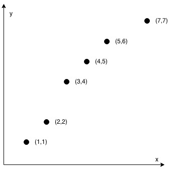

# 缀点成线

## 题意

在一个  `XY` 坐标系中有一些点，我们用数组  `coordinates`  来分别记录它们的坐标，其中  `coordinates[i] = [x, y]`  表示横坐标为 `x`、纵坐标为 `y`  的点。

请你来判断，这些点是否在该坐标系中属于同一条直线上，是则返回 `true`，否则请返回 `false`。

## 示例

### 示例 1：

```
输入：coordinates = [[1,2],[2,3],[3,4],[4,5],[5,6],[6,7]]
输出：true
```


### 示例 2：

```
输入：coordinates = [[1,1],[2,2],[3,4],[4,5],[5,6],[7,7]]
输出：false
```



## 提示

- `2 <= coordinates.length <= 1000`

- `coordinates[i].length == 2`

- `-10^4 <= coordinates[i][0], coordinates[i][1] <= 10^4`

- `coordinates 中不含重复的点`

## 出处

链接：https://leetcode-cn.com/problems/check-if-it-is-a-straight-line

## 思路

这题考的是数学，初中还是小学我忘了。线性函数可以用`f(x) = kx + b`来表示，k 为系数，b 为常数。通过相关的推倒，我们可以得到这样一个式子`f(x1) - f(x2) = k (x1 - x2)`.这里如果你写成这样`(f(x1) - f(x2)) / (x1 - x2) = k`,其实是很危险的，因为`x1 - x2`有可能为 0. 但是这题我们是要比 k 一不一样啊，怎么办？我在找一个点，把除法转换成乘法，即判断`d1 * x2 === d2 * x1`, 嗯，其实就是在考斜率。

## 代码

```javascript
/**
 * @param {number[][]} coordinates
 * @return {boolean}
 */
const checkStraightLine = function (coordinates) {
  const len = coordinates.length;
  if (len === 2) {
    return true;
  }
  const x1 = coordinates[1][0] - coordinates[0][0];
  const y1 = coordinates[1][1] - coordinates[0][1];
  for (let i = 0; i < len; i++) {
    const x2 = coordinates[i][0] - coordinates[0][0];
    const y2 = coordinates[i][1] - coordinates[0][1];
    if (x1 * y2 !== x2 * y1) {
      return false;
    }
  }
  return true;
};

export default checkStraightLine;
```

## 测试

```javascript
import checkStraightLine from '../../code/leetcode/1232';

describe('test function checkStraightLine: ', () => {
  test('test case coordinates = [[1,2],[2,3],[3,4],[4,5],[5,6],[6,7]]', () => {
    const res = checkStraightLine([
      [1, 2],
      [2, 3],
      [3, 4],
      [4, 5],
      [5, 6],
      [6, 7],
    ]);
    expect(res).toBe(true);
  });
  test('test case coordinates = [[1,1],[2,2],[3,4],[4,5],[5,6],[7,7]]', () => {
    const res = checkStraightLine([
      [1, 1],
      [2, 2],
      [3, 4],
      [4, 5],
      [5, 6],
      [7, 7],
    ]);
    expect(res).toBe(false);
  });
  test('test case coordinates = [[1,2],[2,3],[3,5]]', () => {
    const res = checkStraightLine([
      [1, 2],
      [2, 3],
      [3, 5],
    ]);
    expect(res).toBe(false);
  });
  test('test case coordinates = [[0,0],[0,1],[0,-1]]', () => {
    const res = checkStraightLine([
      [0, 0],
      [0, 1],
      [0, -1],
    ]);
    expect(res).toBe(true);
  });
  test('test case coordinates = [[0,0],[0,5],[5,5],[5,0]]', () => {
    const res = checkStraightLine([
      [0, 0],
      [0, 5],
      [5, 5],
      [5, 0],
    ]);
    expect(res).toBe(false);
  });
});
```

## 说明

本文首发于 GitHub 仓库`https://github.com/ataola/coding`，线上阅读地址：`https://zhengjiangtao.cn/coding/`，转载请注明出处，谢谢！
